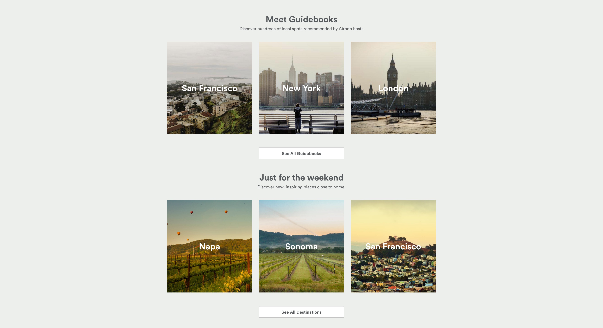

# AirBnB

Lots of websites, including Facebook and Airbnb, use a grid layout to display
common elements, such as information cards, photos, and other information. The
best way to learn how to create these different layouts is to try them
ourselves. So let's try recreating a portion of
[Airbnb's website](https://www.airbnb.com/).

## Prerequisites

- HTML
- Styling with CSS
- Layout with either CSS Grid or Flexbox

## Instructions

1. Fork and clone this repository.
1. Change into the new directory.
1. Fulfill the listed requirements.

Starter code is available in [`lib/`](lib/). Complete your work inside that
directory.

Please turn in your submission by the deadline on your cohort calendar.

## Requirements

Build out the HTML and CSS necessary to build a website that matches this mock:

Your solution should match this mock as closely as possible.

Additionally, your css should pass the
[CSS Validator](https://jigsaw.w3.org/css-validator/).

## Bonus

Finish early? Great! Deploy your website to
[GitHub Pages](https://pages.github.com/).

## Plagiarism

Take a moment to refamiliarize yourself with the
[Plagiarism policy](https://git.generalassemb.ly/DC-WDI/Administrative/blob/master/plagiarism.md).
Plagiarized work will not be accepted.

## [License](LICENSE)

1.  All content is licensed under a CC­BY­NC­SA 4.0 license.
1.  All software code is licensed under GNU GPLv3. For commercial use or
    alternative licensing, please contact legal@ga.co.
