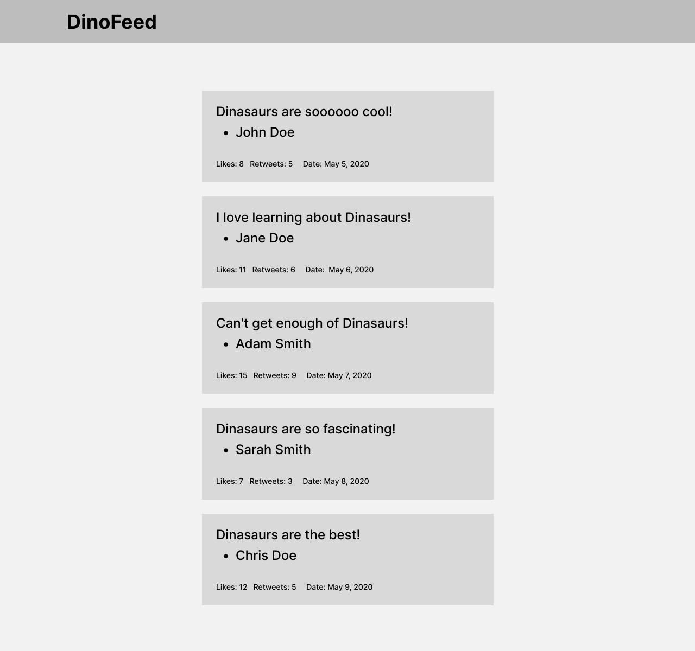

# Dinosaur Twitter

In this exercise, you're going to build a simple, Twitter-like application for
displaying a feed of messages about dinosaurs and how cool they are (dinosaurs
are very cool).

## Prerequisites

- HTML, CSS, and JavaScript
- Basic React:
  - Defining components
  - Working with props
  - Rendering and nesting components

## Instructions

1. Fork and clone this repository.
2. Change into the new directory.
3. Use `create-react-app` to generate a new React application
4. Install dependencies.
6. Fulfill the listed requirements.

Starter code is available in [`lib/challenge.js`](lib/challenge.js).

You may wish to refer to [FAQs](https://github.com/ga-wdi-boston/meta/wiki/)
related to [forking,
cloning](https://github.com/ga-wdi-boston/meta/wiki/ForkAndClone).

## Requirements

Create a new React application using `create-react-app` and display a feed of
Tweets (provided in `lib/challenge.js`).

Your application should have the following components:

- `App.js` - the root-level, Application component that renders your feed of messages.
- `Feed.js` - A component that renders a list of Message components
- `Message.js` - A component that renders a single message, passed in through props

Your application should look like this:

## Bonus

Bonuses are described after the requirements, if included. They should be worked
on **only after** passing requirements.

Sometimes, we ask questions that promote thinking critically about code.

## [License](LICENSE)

1.  All content is licensed under a CC­BY­NC­SA 4.0 license.
1.  All software code is licensed under GNU GPLv3. For commercial use or
    alternative licensing, please contact legal@ga.co.
